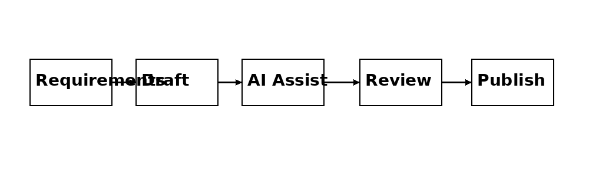

# My Approach to Technical Documentation

## Clarity First

I create documentation that is easy to scan, understand, and use. Clear structure and consistent terminology are essential.

## Audience-Focused Writing

I tailor documentation to different audiences:
- Developers (API documentation)
- End users (user guides)
- Support teams (troubleshooting)

## Structured Content

I use structured writing practices:
- Markdown
- Consistent headings
- Reusable templates

## Collaboration

I work closely with:
- Engineers
- Product managers
- Support teams

## Documentation Workflow

## Continuous Improvement

Documentation is continuously improved based on feedback and usage.
