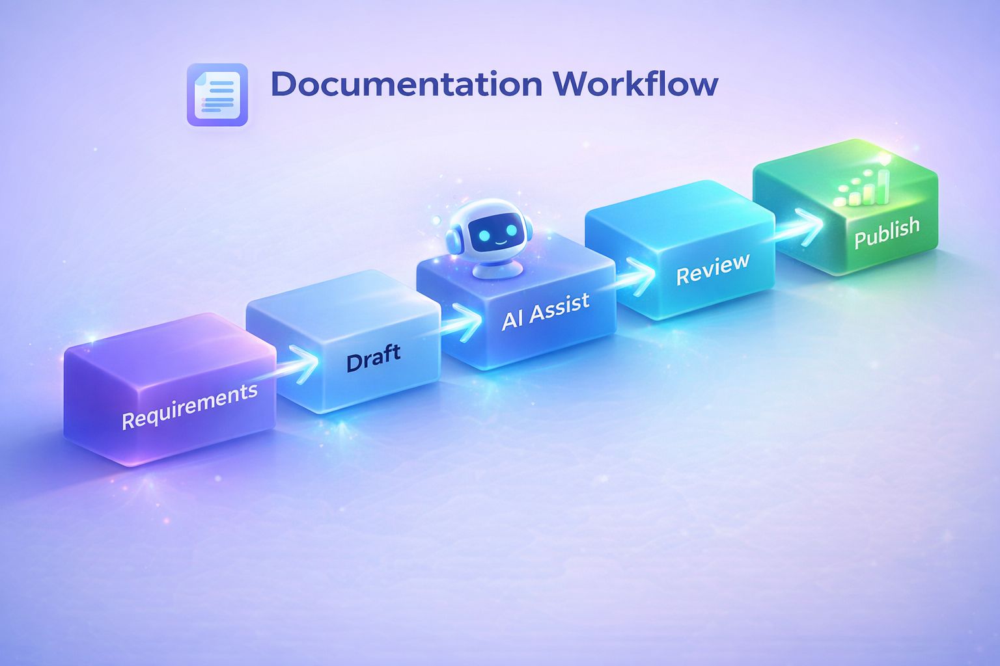

# My Approach to Technical Documentation

## Overview

I create technical documentation that is clear, structured, and practical. My goal is to help users find the information they need quickly, whether they are developers, end users, or support teams.

## Core Principles

### Clarity First

I focus on content that is easy to scan, understand, and use. Clear headings, concise wording, and consistent terminology are essential.

### Audience-Focused Writing

I adapt documentation based on the reader’s needs:

- Developers need accurate API references and implementation details.
- End users need guided steps and task-based documentation.
- Support teams need troubleshooting content with actionable resolutions.

### Structured Content

I use structured writing practices to improve usability and maintainability:

- Markdown-based authoring.
- Consistent heading hierarchy.
- Reusable templates and documentation patterns.
- Version-controlled documentation workflows.

### Cross-Functional Collaboration

Effective documentation depends on strong collaboration. I work closely with:

- Engineers.
- Product managers.
- Support teams.
- Operations stakeholders.

## Documentation Workflow

This workflow reflects how I approach documentation delivery: gather requirements, create a draft, use AI where appropriate, review carefully, and publish with quality and consistency in mind.

## Continuous Improvement

Documentation is not a one-time deliverable. I continuously improve content based on feedback, product changes, and user needs.
