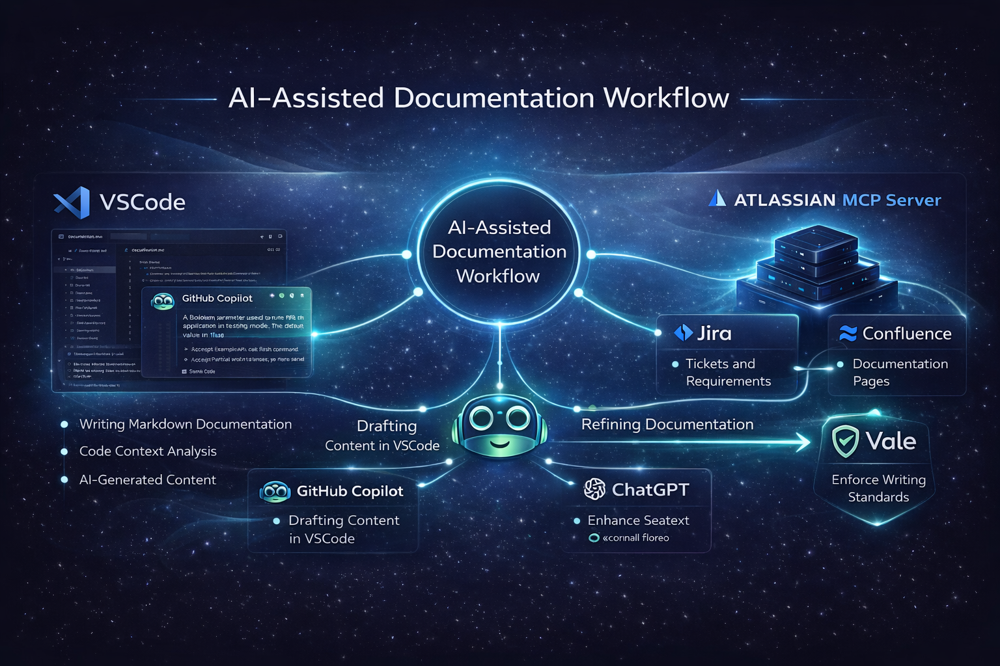

<link rel="stylesheet" href="/assets/style.css">

<section class="hero-shell">
  <aside class="hero-profile">
    
EF

    <h1 class="profile-name">Erik Feher</h1>
    
Senior Technical Writer

    
API • SaaS • Docs-as-Code

    

      <a href="mailto:erofeher11@hotmail.com">Email</a>
      <a href="https://github.com/erofeher">GitHub</a>
      <a href="documentation-samples.html">Samples</a>
      <a href="approach.html">Approach</a>
    

  </aside>

  <main class="hero-content">
    <h2>About Me</h2>

    

      I create clear, scalable documentation for API, SaaS, and cloud products. My work spans developer guides, API references, troubleshooting content, and documentation systems designed for long-term maintainability.
    

    

      I work with Jira and Confluence as the source of truth, then develop and refine content using Markdown, Git, VSCode, Vale, GitHub Copilot, ChatGPT, and Atlassian MCP Server.
    

    

      <a class="primary-btn" href="documentation-samples.html">View samples</a>
      <a class="secondary-btn" href="ai-documentation.html">AI in Technical Writing</a>
    

    

      <section class="info-block">
        <h3>Focus Areas</h3>
        <ul>
          <li>API documentation</li>
          <li>SaaS product documentation</li>
          <li>Developer onboarding guides</li>
          <li>Docs-as-code workflows</li>
          <li>AI-assisted documentation</li>
        </ul>
      </section>

      <section class="info-block">
        <h3>Core Workflow</h3>
        <ul>
          <li>Jira and Confluence as source of truth</li>
          <li>Markdown and Git for maintainable delivery</li>
          <li>Vale checks for quality and consistency</li>
          <li>AI-assisted drafting and refinement</li>
          <li>Editorial control over clarity and accuracy</li>
        </ul>
      </section>
    

  </main>
</section>

<section id="portfolio-sections" class="content-section">
  <h2>Portfolio Sections</h2>

  

    <a class="content-card" href="approach.html">
      <h3>My Approach</h3>
      
How I structure documentation for clarity, maintainability, and cross-team collaboration.

      Open page →
    </a>

    <a class="content-card" href="documentation-samples.html">
      <h3>Documentation Samples</h3>
      
Examples of developer-focused documentation, API references, user guidance, and troubleshooting content.

      View samples →
    </a>

    <a class="content-card" href="ai-documentation.html">
      <h3>AI in Technical Writing</h3>
      
How I use AI tools to support documentation workflows without losing editorial control.

      Read more →
    </a>
  

</section>

<section id="how-i-work" class="content-section">
  <h2>How I work</h2>

  

    

      

        I build documentation workflows that connect product context, engineering inputs, and user needs. The goal is not only to write clear content, but to create documentation systems that stay usable and maintainable over time.
      

      <ul class="check-list">
        <li>Structured process grounded in product context</li>
        <li>Docs-as-code practices using Markdown and Git</li>
        <li>AI-assisted drafting and refinement</li>
        <li>Vale checks for quality and consistency</li>
        <li>Editorial control over clarity and accuracy</li>
      </ul>
    

    

      
    

  

</section>

<section id="skills-technologies" class="content-section">
  <h2>Skills &amp; Technologies</h2>

  

    

      <h3>Documentation &amp; Publishing</h3>
      <ul>
        <li>MadCap Flare (Advanced) – Creating and publishing structured HTML documentation and user guides.</li>
        <li>Markdown / HTML (Advanced) – Writing structured, maintainable documentation content.</li>
        <li>VSCode (Advanced) – Authoring and managing documentation in Markdown-based workflows.</li>
      </ul>
    

    

      <h3>Version Control &amp; Workflow</h3>
      <ul>
        <li>GitHub / GitLab (Advanced) – Managing documentation using Git-based workflows and version control.</li>
        <li>Documentation-as-Code – Maintaining structured documentation in collaborative environments.</li>
      </ul>
    

    

      <h3>Knowledge Base &amp; Support Content</h3>
      <ul>
        <li>Zendesk (Advanced) – Managing and maintaining knowledge base content.</li>
        <li>Intercom (Advanced) – Creating and structuring customer-facing help center content.</li>
      </ul>
    

    

      <h3>AI-Assisted Documentation</h3>
      <ul>
        <li>GitHub Copilot (Advanced) – AI-assisted content creation and documentation drafting within development workflows.</li>
        <li>ChatGPT (Advanced) – Supporting documentation workflows, content structuring, and editing.</li>
      </ul>
    

    

      <h3>Multimedia &amp; Training Content</h3>
      <ul>
        <li>Camtasia (Advanced) – Creating video tutorials and training materials for documentation.</li>
      </ul>
    

  

</section>

<section id="tools-workflow" class="content-section">
  <h2>Tools and workflow</h2>

  

    VSCode
    Markdown
    GitHub
    GitLab
    Jira
    Confluence
    Vale
    GitHub Copilot
    ChatGPT
    Atlassian MCP Server
  

</section>
